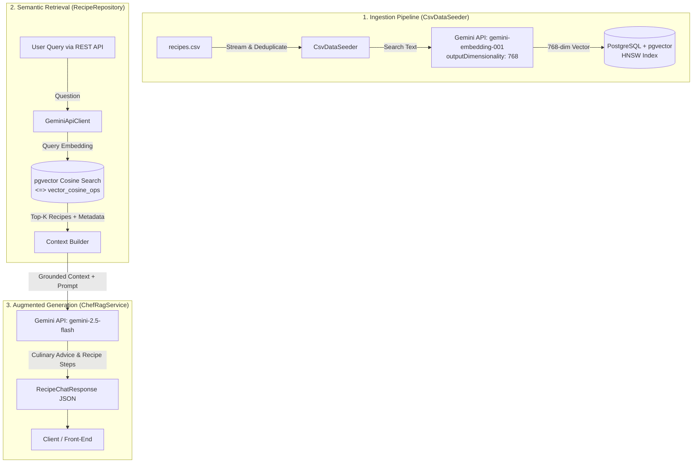

# 🍳 Culinary Chef RAG (Retrieval-Augmented Generation)

> **⚠️ Educational & Study Project:** This repository is an experimental study project exploring **Retrieval-Augmented Generation (RAG)** architecture using **Java 25**, **Spring Boot 4**, **PostgreSQL (`pgvector`)**, and **Google Gemini API**. It demonstrates how to build a production-grade, grounded culinary assistant from the ground up without relying on heavy black-box abstraction frameworks.

---

## 📖 Overview

This project implements an intelligent, AI-powered culinary assistant capable of recommending recipes, answering culinary questions, and tailoring instructions strictly based on a curated dataset of recipes (`recipes.csv`).

Traditional LLM chat endpoints often suffer from **hallucinations** or lack domain-specific knowledge. By applying **Retrieval-Augmented Generation (RAG)**:
1. The system converts raw recipes into dense semantic vectors (embeddings).
2. Stores and indexes them in **PostgreSQL** using the **`pgvector`** extension and an **HNSW (Hierarchical Navigable Small World)** index.
3. When a user asks a question, the application computes the semantic embedding of the query, retrieves the **Top-K** most relevant recipes via cosine similarity, and augments the LLM prompt with this factual context.
4. The LLM (**Google Gemini**) synthesizes an accurate, grounded answer backed directly by the retrieved recipes.

---

## 🏗️ Architecture & RAG Pipeline



---

## 🛠️ Tech Stack & Key Components

| Component | Technology | Description |
| :--- | :--- | :--- |
| **Language** | **Java 25** | Leverages modern Java features (Compact Record constructors, Pattern Matching, Stream API). |
| **Framework** | **Spring Boot 4.1.1** | WebMVC, Spring Data JPA, Spring Actuator, Spring Test. |
| **Database** | **PostgreSQL 16 + pgvector** | Vector database storing 768-dimension embeddings with an HNSW cosine index. |
| **Embedding Model** | **`gemini-embedding-001`** | Configured with `outputDimensionality: 768` (Matryoshka Representation Learning). |
| **Generation Model**| **`gemini-2.5-flash`** | High-throughput, low-latency reasoning LLM for prompt synthesis. |
| **HTTP Client** | **Spring 6/7 `RestClient`** | Clean, fluent synchronous HTTP client communicating with Google APIs. |
| **CSV Parser** | **Apache Commons CSV 1.11.0** | Robust streaming CSV parser with missing column support. |
| **Containerization**| **Docker & Docker Compose** | Multi-stage Alpine container build (`temurin:25-jre-alpine`) with health checks. |

---

## 🌟 Key Architecture & Design Details

### 1. Hexagonal & Clean Modular Design
- **Domain Purity:** Domain entities and records (e.g., `Greeting`, `Recipe`) enforce invariant rules natively without external framework coupling.
- **Inbound/Outbound Decoupling:** REST controllers interact only through ports/use-case abstractions, keeping web concerns separate from domain logic.
- **Dedicated RAG Subsystem:** Isolated in `com.example.demo.rag` with its own clients, DTOs, controllers, repositories, and seeders.

### 2. Dual-Level Deduplication
- Many public recipe datasets contain repeated rows or duplicated blocks.
- Ingestion enforces in-memory tracking (`Set<String>`) and database validation (`existsByRecipeName`) to ensure identical recipes are never ingested multiple times.
- PostgreSQL includes a `UNIQUE INDEX (recipe_name)` constraint.
- The service layer performs an additional deduplication step to prevent duplicate cards in `matchedRecipes`.

### 3. Hibernate 6/7 `@ColumnTransformer` for `pgvector`
- Rather than relying on fragile custom type serializers that default to `bytea`, the entity uses `@ColumnTransformer`:
  ```java
  @Column(name = "embedding", nullable = false, columnDefinition = "vector(768)")
  @ColumnTransformer(read = "embedding::text", write = "cast(? as vector)")
  private String embedding;
  ```
- This ensures standard JDBC `VARCHAR` handling on the Java side and native `vector(768)` casting in PostgreSQL.

### 4. Matryoshka Representation Learning (MRL)
- `gemini-embedding-001` natively generates 3072-dimension vectors.
- By providing `"outputDimensionality": 768` in the request payload, the embedding is scaled down to 768 dimensions without degrading retrieval quality, perfectly matching the database schema and maximizing indexing performance.

---

## 🚀 How to Run Locally

### Prerequisites
- [Docker](https://docs.docker.com/get-docker/) and [Docker Compose](https://docs.docker.com/compose/)
- A **Google Gemini API Key** (obtainable free of charge at [Google AI Studio](https://aistudio.google.com/))
- (Optional, for running without Docker): **Java 25** and **Maven**

---

### Step 1: Clone the Repository & Configure `.env`

1. Clone the project:
   ```bash
   git clone https://github.com/your-username/demo.git
   cd demo
   ```

2. Create a `.env` file in the root directory (based on the template below):
   ```properties
   # PostgreSQL Database Configuration
   POSTGRES_DB=demodb
   POSTGRES_USER=postgres
   POSTGRES_PASSWORD=postgres

   # Google Gemini API
   GEMINI_API_KEY=your_actual_gemini_api_key_here
   GEMINI_BASE_URL=https://generativelanguage.googleapis.com
   GEMINI_EMBEDDING_MODEL=gemini-embedding-001
   GEMINI_CHAT_MODEL=gemini-2.5-flash

   # RAG Ingestion Settings
   RAG_BATCH_LIMIT=50
   RAG_RATE_DELAY_MS=2000
   ```

> **Tip:** Under the Gemini API Free Tier (15 RPM), setting `RAG_RATE_DELAY_MS=2000` (2-second pause per item) ensures ingestion never triggers HTTP `429 Too Many Requests`.

---

### Step 2: Run with Docker Compose (Recommended)

Run both the PostgreSQL vector database and the Spring Boot application:

```bash
docker compose up -d --build
```

Monitor the application and the automatic CSV ingestion:

```bash
docker compose logs -f app
```

You will observe logs similar to:
```text
INFO 1 --- [demo] [main] c.example.demo.rag.seeder.CsvDataSeeder : Starting CSV data ingestion from /app/recipes.csv with batch limit of 50...
INFO 1 --- [demo] [main] c.example.demo.rag.seeder.CsvDataSeeder : Ingested recipe 1/50: Apple-Cranberry Crostada
INFO 1 --- [demo] [main] c.example.demo.rag.seeder.CsvDataSeeder : Ingested recipe 2/50: Apple Pie by Grandma Ople
...
INFO 1 --- [demo] [main] c.example.demo.rag.seeder.CsvDataSeeder : Finished CSV data ingestion. Successfully ingested 31 recipes.
```

---

### Step 3: (Alternative) Run App Locally with Maven

If you prefer to run the Spring Boot application directly on your host machine:

1. Start only the PostgreSQL vector database:
   ```bash
   docker compose up -d postgres
   ```

2. Set your environment variables in PowerShell or Bash:
   ```powershell
   $env:GEMINI_API_KEY="your_actual_gemini_api_key_here"
   $env:SPRING_DATASOURCE_URL="jdbc:postgresql://localhost:5432/demodb"
   $env:SPRING_DATASOURCE_USERNAME="postgres"
   $env:SPRING_DATASOURCE_PASSWORD="postgres"
   $env:RAG_BATCH_LIMIT="50"
   ```

3. Run the Spring Boot application:
   ```bash
   ./mvnw spring-boot:run
   ```

---

## 📡 API Reference

### 1. Ask the Chef (`POST /api/v1/recipes/chat`)

Submits a natural-language question, performs vector retrieval on indexed recipes, and returns an answer synthesized by the LLM along with the matched recipe cards.

#### Request Parameters (JSON Body)

| Field | Type | Required | Default | Description |
| :--- | :--- | :--- | :--- | :--- |
| `question` | `String` | **Yes** | — | The user's culinary question or list of ingredients. |
| `cuisineFilter`| `String` | No | `null` | Optional substring filter on the recipe category (e.g., `"Desserts"`, `"Pies"`, `"Side Dish"`). |
| `topK` | `Integer`| No | `5` | Number of most similar recipes to retrieve (min: 1, max: 20). |

#### Request Example

```json
{
  "question": "What can I cook using apples, butter, and cinnamon?",
  "cuisineFilter": "Desserts",
  "topK": 3
}
```

#### Response Example

```json
{
  "answer": "Based on the available recipes, here are 3 dessert options you can make with apples, butter, and cinnamon:\n\n1. **Apple Hand Pies**:\n   - Melt butter in a skillet until lightly browned, sauté apples with sugar and cinnamon for 5 minutes, fold into pastry crust, and bake at 400°F (200°C) for 25–30 minutes.\n2. **Apple-Cranberry Crostada**:\n   - Cook sliced apples with butter, sugar, and cranberries until juices thicken, assemble over puff pastry, and bake for 25–30 minutes.\n3. **Easy Apple Pie**:\n   - Layer thinly sliced apples in pastry crust, sprinkle with cinnamon-sugar, dot with butter pieces, and bake at 350°F (175°C) until bubbling.",
  "matchedRecipes": [
    {
      "id": 25,
      "recipeName": "Apple Hand Pies",
      "cuisinePath": "/Desserts/Pies/Apple Pie Recipes/",
      "servings": 4,
      "rating": 4.7,
      "imgSrc": "https://imagesvc.meredithcorp.io/...",
      "similarityScore": 0.694
    },
    {
      "id": 3,
      "recipeName": "Apple-Cranberry Crostada",
      "cuisinePath": "/Desserts/Fruit Desserts/Apple Dessert Recipes/",
      "servings": 8,
      "rating": 4.4,
      "imgSrc": "https://imagesvc.meredithcorp.io/...",
      "similarityScore": 0.691
    },
    {
      "id": 20,
      "recipeName": "Easy Apple Pie",
      "cuisinePath": "/Desserts/Pies/Apple Pie Recipes/",
      "servings": 8,
      "rating": 4.6,
      "imgSrc": "https://imagesvc.meredithcorp.io/...",
      "similarityScore": 0.687
    }
  ]
}
```

---

### Executing Requests via Command Line

#### cURL
```bash
curl -X POST http://localhost:8080/api/v1/recipes/chat \
  -H "Content-Type: application/json" \
  -d '{
    "question": "I have apples and brown sugar. What can I prepare?",
    "cuisineFilter": "Desserts",
    "topK": 3
  }'
```

#### PowerShell
```powershell
Invoke-RestMethod -Uri "http://localhost:8080/api/v1/recipes/chat" `
  -Method Post `
  -Headers @{ "Content-Type" = "application/json; charset=utf-8" } `
  -Body '{
    "question": "I have apples and brown sugar. What can I prepare?",
    "cuisineFilter": "Desserts",
    "topK": 3
  }' | ConvertTo-Json -Depth 5
```

---

### 2. Health & Monitoring Endpoints

- **Health check:** `GET http://localhost:8080/actuator/health`
- **Application info:** `GET http://localhost:8080/actuator/info`

---

## 🧪 Automated Testing

The project maintains **34 automated tests** covering unit, slice, and full database integration levels:

```bash
# Execute the complete test suite
./mvnw test
```

### Test Suite Highlights:
- **`RecipeRepositoryIntegrationTest`**: Tests live vector insertion and similarity search directly against `pgvector` in PostgreSQL.
- **`ChefRagControllerTest`**: Standalone slice tests verifying HTTP contracts, request validation, and error serialization.
- **`ChefRagServiceTest`**: Mockito unit tests verifying prompt composition, Top-K enforcement, and empty-state fallback handling.
- **`CsvDataSeederTest`**: Verifies CSV parsing, header handling, deduplication, and rate-limit backoff.
- **`VectorUtilsTest` & `PGvectorConverterTest`**: Edge case testing for vector array formatting and dimension conversions.
